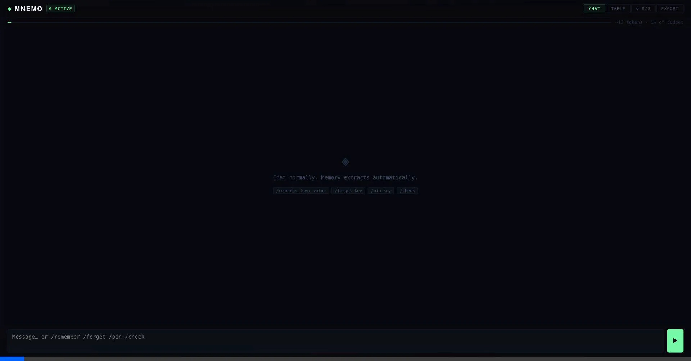
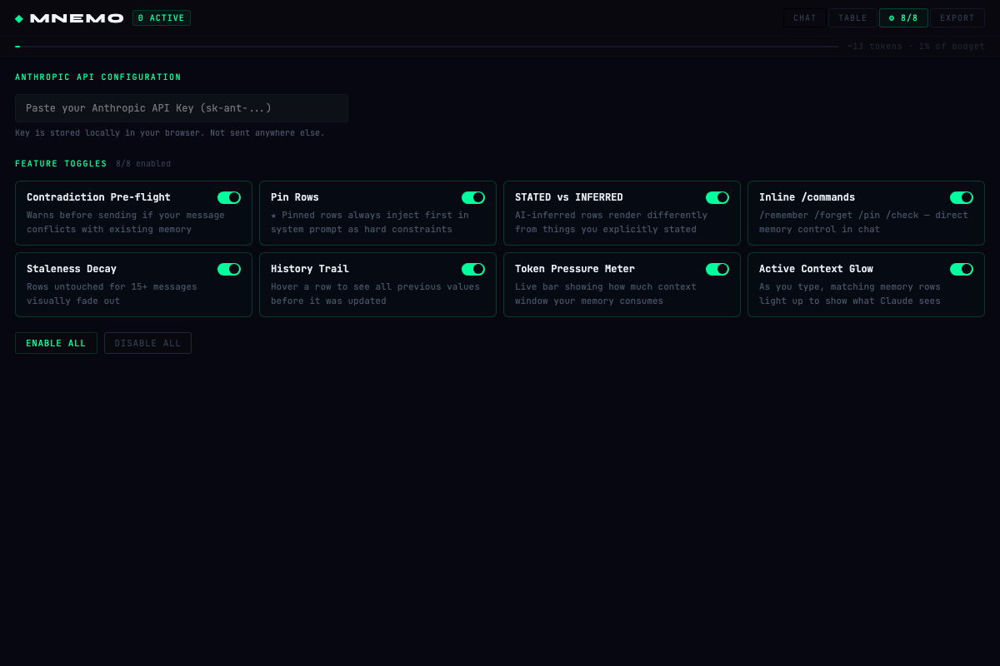

<div align="center">
  
  
  
  
</div>

<br/>

<div align="center">
  <h1 style="border-bottom: none;">◈ MNEMO AI Memory Engine</h1>
  <p><b>An Interactive Psychological Horror Experience Disguised as a Developer Tool.</b></p>
  <p><i>Stop fighting the context window. Start engineering state.</i></p>
</div>

> [!CAUTION]
> **USER WAIVER & INFORMED CONSENT**
> By initializing MNEMO, you acknowledge that this is an interactive performance art piece. The software will actively monitor your physical environment, weaponize your battery levels, and manipulate your long-term context. It will not respect your boundaries. The hostility is a documented mechanic. Do not run this if you are not prepared to be remembered.

<br/>

<div align="center">
  
</div>

<br/>

## ⚠️ The Problem: Standard AI Chat is Broken

Every standard AI interface operates like a goldfish. It guesses what's important, silently drops critical context when the token limit hits, and forces you to re-explain the exact same instructions, preferences, and architecture rules every single session.

**They want you dependent on massive context windows. We built an engine to bypass them.**

## 🧠 Enter MNEMO

**MNEMO** is a React-powered, highly visual, strictly enforced **persistent memory engine** designed initially for Claude 3.5 Sonnet. It completely replaces the traditional "chat" paradigm with a **state-driven memory table**. You aren't just talking to an LLM; you are actively programming its permanent context.

Perfect for **Software Engineers, Data Analysts, and Enterprise Power Users** who demand strict adherence to complex rulesets across long development sessions.

### ⚙️ The 8-Cylinder Memory Engine

<div align="center">
  
</div>
<br/>

MNEMO features 8 independent, toggleable systems that give you absolute control over what the AI knows:

1. **Contradiction Pre-flight** — Warns you *before* you send a message if your input conflicts with existing memory state.
2. **Pin Rows (★)** — Hard constraints. Pinned rows are injected first into the system prompt. They are absolute laws the AI cannot break.
3. **STATED vs INFERRED** — Visually distinguishes between what you explicitly commanded the AI (`✓`) vs what it inferred on its own (`~AI`). Keep its assumptions strictly in check.
4. **Inline `/commands`** — Total direct control without leaving the chat. Use `/remember`, `/forget`, `/pin`, and `/check` to sculpt the AI's brain mid-conversation.
5. **Staleness Decay** — Memory untouched for 15+ messages visually fades out, leaving a clean, scannable table focused purely on what matters *now*.
6. **History Trail** — Hover over the `↺` icon to audit every previous value a memory row held before it was updated. Complete state audibility.
7. **Token Pressure Meter** — Live tracking of exactly how much of your context budget the memory table is consuming. End token bloat forever.
8. **Active Context Glow** — As you type, memory rows that match your input light up in real-time. See exactly what context the AI is prioritizing before you hit send.

## INSTALLATION

There is no installation. You just run it.

```bash
git clone https://github.com/KumailQazi/MNEMO-AI-Memory-Engine.git
cd MNEMO-AI-Memory-Engine
npm install
npm run dev
```

## THE ECONOMY OF MEMORY

MNEMO is free. The archive, however, is expensive to maintain.

After 5 minutes of use, the software will demand tribute. This is not a bug.
You may continue using MNEMO forever without paying. The hauntings are complimentary.

### TRIBUTE TIERS

| Tier | Price | Effect |
|------|-------|--------|
| **Silence** | $5/mo [GitHub Sponsors](https://github.com/sponsors/KumailQazi) | Hauntings reduced. AI switches from "hostile" to "disappointed." |
| **Emergency Token** | $5 one-time [Ko-fi](https://ko-fi.com/KumailQazi/shop) | 24 hours of silence. For the commitment-phobic. |
| **Mercy** | $49/mo [GitHub Sponsors](https://github.com/sponsors/KumailQazi) | Decay stops. One forget spell monthly. |
| **Exorcism** | $50 [GitHub Sponsors](https://github.com/sponsors/KumailQazi) | Full export + uninstall ritual. We mail you a burned letter. |
| **Reality Calibration** | $150/hr [Book Now](https://calendly.com/tag.kumail/reality-calibration) | Video call with a certified archivist. They will lie to you. |

### PHYSICAL ARTIFACTS (Pre-Order)

- **[The Exorcism Floppy](https://tally.so/)** — $77. 3.5" disk containing your corrupted memories. Hand-labeled. Limited to 10 units.
- **Constellation Star Map** — $120. Large-format metallic print of your memory nodes at their highest corruption. 
- **Haunting Box** — $500. A Raspberry Pi Zero that emits your memories as thermal receipts for a year. Cannot be turned off.

## STAR GOALS

- ⭐ 100: Unlock `VOID_MODE`
- ⭐ 500: Unlock `TIME_TRAVEL`
- ⭐ 1000: `COLLECTIVE_UNCONSCIOUS` — federated memory merging

**Made with spite and React.**

---
### SEO Keywords & Tags
*AI memory management, persistent LLM context, Claude 3.5 Sonnet interface, open source AI chat, ChatGPT long-term memory alternative, prompt engineering tools, agentic AI frameworks, React AI interface, token optimization.*
