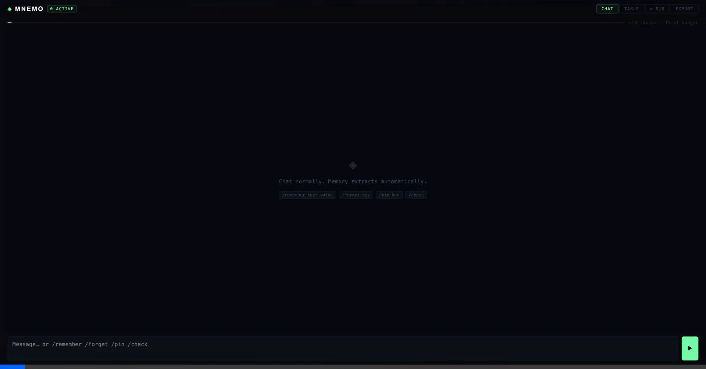
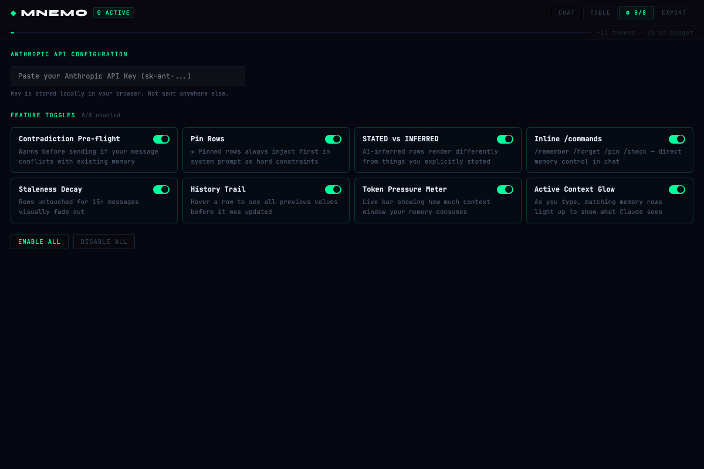

  
  
  
  
  

 

  <h1 style="border-bottom: none;">◈ MNEMO AI Memory Engine</h1>
  
<b>A local-first memory cockpit for LLM chat — with optional performance-art mode.</b>

  
<i>Stop fighting the context window. Start engineering state.</i>

> [!NOTE]
> **Local-first.** Memory and chat history persist in **IndexedDB**. API keys are **encrypted on disk** by the local MNEMO server (not in the browser). Multi-provider BYOK: Anthropic, OpenAI, Google Gemini, xAI Grok, Groq, Cerebras, OpenRouter. See [SECURITY.md](SECURITY.md).

> [!NOTE]
> **This repository** hosts **installers** ([Releases](https://github.com/KumailQazi/MNEMO-AI-Memory-Engine/releases)) and **documentation** only. Application source code is not published on GitHub.

> [!CAUTION]
> **Optional art mode.** MNEMO can include horror-themed UX. Environment-aware prompt hints (**Séance mode**) are **opt-in and off by default**. See Settings.

 

### Demo walkthrough

**[▶ Watch or download demo (MP4, ~11 MB)](https://github.com/KumailQazi/MNEMO-AI-Memory-Engine/releases/download/v1.0.9/MNEMO-demo.mp4)**

Also on [Releases → v1.0.9 → MNEMO-demo.mp4](https://github.com/KumailQazi/MNEMO-AI-Memory-Engine/releases/tag/v1.0.9)

<i>Memory table, chat, settings, and inline <code>/commands</code>. Unmute for audio.</i>

 

  

 

## The Problem

Standard AI chat drops context, hides what the model "remembers," and re-summarizes your rules every session. MNEMO gives you a **visible memory table** you edit, pin, and audit — then inject into the system prompt with **estimated token pressure** and **smart retrieval**.

## Enter MNEMO

**MNEMO** is a React app for developers who want **human-in-the-loop** control over LLM memory:

- **Persistent** memory + chat (IndexedDB)
- **Pin rows** for high-priority prompt constraints (LLMs may still drift — see limitations)
- **STATED vs INFERRED** — see what you said vs what the model assumed
- **`/remember`, `/forget`, `/pin`, `/check`** inline commands
- **Smart retrieval** — top-k relevant rows + pins per message (optional)
- **Staleness** — old rows fade and can be excluded from the prompt
- **Conflict pre-flight** — heuristic warning + resolve before send
- **Episode export** — full chat + memory JSON for backup or migration
- **Three-pane cockpit** — sidebar nav, chat or memory table in the center, inspector on the right (⌘K command palette)
- **Multi-provider BYOK** — Anthropic · OpenAI · Google Gemini · xAI Grok · Groq · Cerebras · OpenRouter
- **Desktop app** — Tauri shell + local API ([GitHub Releases](https://github.com/KumailQazi/MNEMO-AI-Memory-Engine/releases))

### The 8-Cylinder Memory Engine

  

 

MNEMO features 8 independent, toggleable systems in Settings (bento grid):

| # | Feature | What it does |
| --- | --- | --- |
| 1 | **Contradiction pre-flight** | Warn before send if input conflicts with stored memory |
| 2 | **Pin rows (★)** | Pinned rows inject first into the system prompt |
| 3 | **STATED vs INFERRED** | Label what you said vs what the model assumed |
| 4 | **Inline `/commands`** | Sculpt memory without leaving chat |
| 5 | **Staleness decay** | Fade rows untouched for 15+ messages |
| 6 | **History trail** | Audit previous values per row (`↺`) |
| 7 | **Token pressure meter** | Estimated context budget for the memory block |
| 8 | **Active context glow** | Rows matching your draft input highlight in real time |

Install and troubleshooting — see [DEPLOYMENT.md](DEPLOYMENT.md).

## Installation

### Desktop app (recommended)

**[Download from GitHub Releases](https://github.com/KumailQazi/MNEMO-AI-Memory-Engine/releases)** — pick the installer for **your OS only** (not cross-platform):

| OS | Artifact |
| --- | --- |
| **Apple Silicon** (M1/M2/M3/M4) | `*_aarch64.dmg` |
| **Intel** (Core i5/i7/i9) | `*_x64.dmg` (from **v1.0.5+**) |
| **Linux** | `.deb` or `.AppImage` |
| **Windows** | `MNEMO_1.0.9_x64_en-US.msi` or `MNEMO_1.0.9_x64-setup.exe` |

> [!TIP]
> Use **v1.0.9+** for memory fixes and `/remember last`. **v1.0.8+** for Groq/Cerebras and session save fixes. **v1.0.7+** for new providers.

> [!WARNING]
> **v1.0.3** (and broken **v1.0.4** upload) only had Apple Silicon. Intel Macs need **`_x64.dmg`** from **v1.0.5+**. **v1.0.6+** fixes the local API not starting from Applications. **v1.0.7+** adds **Groq** and **Cerebras** (Groq ≠ Grok — use the matching provider for your key).

Requires **Node.js 20+** on PATH at runtime. See [RELEASE.md](RELEASE.md).

API keys are stored **encrypted on disk** by the local MNEMO server — not in the browser. See [DEPLOYMENT.md](DEPLOYMENT.md).

### First launch

- **macOS:** If Gatekeeper blocks the app, right-click → **Open** → **Open** again.
- **Windows:** SmartScreen may warn on unsigned builds — **More info → Run anyway**.
- **Settings:** Choose your LLM provider, paste API key, click **Save API key to server**.

### Quick memory commands (in chat)

| Command | Example |
| --- | --- |
| Save key + value | `/remember name \| Kumail` |
| Save last assistant reply | `/remember last \| my-project` |
| List memory | `/check` |

**Groq** keys (`gsk_…`) → provider **Groq**. **Grok** → provider **xAI (Grok)** with a key from [console.x.ai](https://console.x.ai).

## Limitations (honest)

- Token counts are **estimates** (heuristic / tiktoken; provider tokenization may differ).
- Contradiction detection is **heuristic**, not semantic.
- Active context glow is **keyword match**, not model internals.
- The MAP tab groups by **category**, not a full knowledge graph.
- Pinned rows are **strong prompt priority**, not hard guarantees.

## Optional: Performance Art & Support

MNEMO may include horror-themed UX. **Séance mode** (battery/time/network hints in the system prompt) is disabled unless you enable it in Settings.

> [!IMPORTANT]
> **Patron tiers (coming soon).** Payment links will go live after fulfillment is wired up. Until then, MNEMO is free to use locally.

## Star Goals (roadmap)

- ⭐ 100: `VOID_MODE`
- ⭐ 500: `TIME_TRAVEL` (point-in-time memory queries)
- ⭐ 1000: `COLLECTIVE_UNCONSCIOUS` (requires legal review — not planned for v1)

**Made with spite and React.**

---

## Docs

- [DEPLOYMENT.md](DEPLOYMENT.md) — install, Node.js, troubleshooting
- [RELEASE.md](RELEASE.md) — release artifacts explained
- [SECURITY.md](SECURITY.md) — privacy and deployment

---

### Keywords

`ai memory management` · `persistent llm context` · `prompt engineering` · `byok` · `claude` · `openai` · `gemini` · `local-first` · `tauri desktop` · `react` · `token optimization` · `agent memory cockpit`
